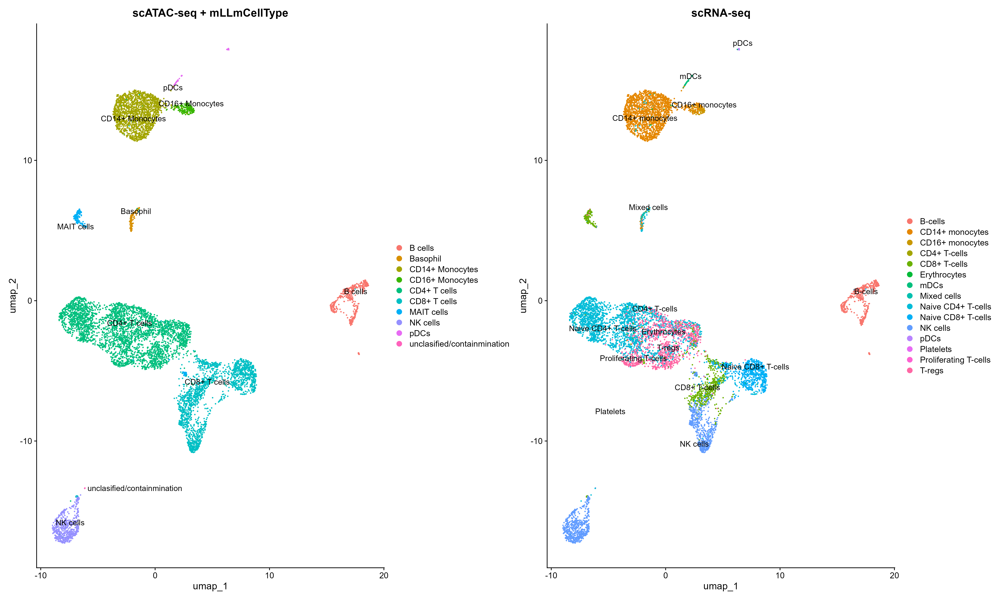

## 📌 1. Overview
- **Status:** Concluded & Handover (18-03-2026)
- **Author:** Xiaoyue Deng (Departure Date: 2026-03)
- **Primary Data Source:** [10x Genomics EpiATAC dataset](https://www.10xgenomics.com/datasets/10k-human-pbmcs-atac-v2-chromium-x-2-standard)
- **Link to repository:** [Github](https://github.com/Xiaoyue-Deng/EpiATAC_workflow)
- **Computational Environment:** HPC + Local env

## 📌 2.Brief Info 
- Greetings! This repository contains the scATAC(Assay for Transposase-Accessible Chromatin using sequencing) analysis pipeline. This protocol is still raw and have plenty of rooms for improvement. In brief, this repository tested the standard analysis of EpiATAC sequencing from 10x genomices, which is the technique we plan to use for the trained immunity project. Since we do not have any available AD datasets of scATAC, this is a healthy dataset, used solely for pipeline establishment. A scRNAseq dataset was used to check the robustness of population annotation.
- Note that because this repository has been sorted post-analysis, some directories may be relocated or removed. If you are running the scripts, double check the path and set it to the correct one.

## 📌 3. About the workflow and dataset
The first step of process uses cellRanger-atac. Subsequent scripts and resources requirements can be found at `/storage/homefs/xd22m086/05_CK/ATAC_10X/scripts`. The complete collection of processed files can also be found there, if you are interested in trying out the workflow yourself. In brief, the workflow automatically fetches everything under the repository, performs cellranger-atac, use `findPeaks` to identify ATAC peaks, annotated the peaks using `annotatePeaks.pl`, using hg38 reference genome. 

The downstream analysis is performed using `Signac` and `Seurat`. Basically, a `chromatin assay` obj was built with matrices and fragment files, gene annotation mapped to `hg38`. Quality control is performed with following metrics: TSS enrichment > 2, nucleosome signal < 4, and reads in peaks > 15%. Normalization done with `TF-IDF` and `RunSVD`.

I spent most times on the cell typing, since the original method from 10x (where they recommended using promoter sum for identification) did not work. This workflow used a triple validation method for cell typing: 
* 1. Converting peaks into a 'pseudo-RNA' matrix to check for canonical markers. CAUTION: This is not the same as RNAseq expression matrix, as this is not a real 'expression level'. So no DEG.
* 2. For the markers found in the pseudo-RNA matrix, used Azimuth and mLLmCelltype for annotation. mLLmCelltype outperformed Azimuth greatly.  
* 3. scRNA-seq Integration with Zhang_2023 dataset, by finding transfer anchors to project the annotation from zhang onto the ATAC clusters (total of `11866` overlaps). 
This workflow also identified cluster-specific peaks(e.g., CD14+ vs CD16+ Monocytes) using logistics regression tests, and performed the functional annotation using `ClosestFeature`.

## 📌 4. About the laboratory aspects...
10X protocol for ATACseq nuclei isolation can be found at [10x Nuclei Isolation Protocol](./demo_figure/CG000169_DemonstratedProtocol_NucleiIsolation_ATAC_Sequencing_Rev_E.pdf). By the time this README is written, we (me & Severin) have tried once this protocol, and the image of isolated nuclei is found in [this folder](./contess_image_nuclei_isolation/). We did not make modifications to the protocol. For questions regarding the protocol, you can contact the 10x contact [Andreia](andreia.gouvea@10xgenomics.com). I have mainly been communicating with her regarding details of the protocol. You should also contact her for future purchase of the actual kit.

## 📌 5. Future plan
Future plan is to use this workflow to analyse our in house EpiATAC dataset. The current choice of method is 10x EpiATAC, and we will do both bulk and atac-sequencing. For the latest plan of the antrag, see Trained Immunity Antrag. 